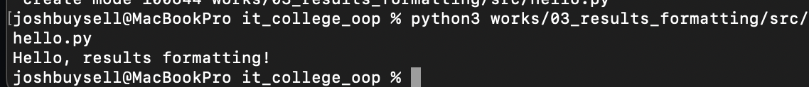

# it_college_oop
Root for It college work

# Звіт до роботи

## Тема: Перша програма штучного інтелекту. Виконання та пояснення

### Мета роботи: Ознайомитись із базовим підходом до створення першої програми, отримати відповідь від ChatGPT, виконати програму та оформити результати у вигляді звіту.

---

### Виконання роботи

- Результати виконання завдання:

  1. Сформульовано запит до ChatGPT: "Яку першу програму написав би штучний інтелект і чи міг би він її пояснити?"
  2. Отримано відповідь від ChatGPT у вигляді пояснення та коду програми:

> Якщо штучний інтелект мав би написати свою першу програму, це, ймовірно, була б класична програма "Hello, World!". Вона є традиційним першим кроком у вивченні будь-якої мови програмування.
>
> **Пояснення:**
> Програма "Hello, World!" виводить простий текст на екран. Це дозволяє переконатися, що середовище розробки налаштовано правильно, і дає базове уявлення про синтаксис мови.

  3. Додано програму у Jupyter notebook та виконано її:

```python
print("Hello, World!")
```

  4. Програма вивела значення:

```
Hello, World!
```

  5. Отримано наступні результати: успішне виконання програми, підтвердження працездатності середовища.
  6. Навчились: створювати та запускати прості програми у Jupyter notebook, оформлювати звіт за шаблоном.

- Вставлені рисунки (скріншоти виконання):

  

- Вставлений код / текстовий або числовий результат:

```python
print("Hello, World!")
```
<< Програма успішно виконалась та вивела текст: Hello, World! >>

---

### Висновок:

- ❓ Що зроблено в роботі: Створено та виконано першу програму "Hello, World!" за допомогою ChatGPT.
- ❓ Чи досягнуто мети роботи: Так, мету досягнуто.
- ❓ Які нові знання отримано: Ознайомлення з базовим синтаксисом Python, роботою у Jupyter notebook, структурою звіту.
- ❓ Чи вдалось відповісти на всі питання задані в ході роботи: Так.
- ❓ Чи вдалося виконати всі завдання: Так.
- ❓ Чи виникли складності у виконанні завдання: Ні.
- ❓ Чи подобається такий формат здачі роботи (Feedback): Так, формат зручний.
- ❓ Побажання для покращення (Suggestions): Додати більше практичних прикладів для закріплення знань.

# Опис програми my_first_app.py

## Призначення

Ця програма демонструє базові навички роботи з Python: використання змінних, форматування рядків та виведення поточної дати й часу. Вона також ілюструє, як додати власні дані (ім'я, місто) у вивід.

## Код програми

```python
from datetime import datetime

name = "Viktor"
location = "Lviv"

print(f"{name} start programming at {datetime.now()}. {location} is the best city!")
```

## Результат виконання

```
Viktor start programming at 2025-09-28 12:34:56.789012. Lviv is the best city!
```

(Час буде відповідати моменту запуску програми)

## Пояснення
- Ім'я та місто задаються у змінних.
- Використовується модуль `datetime` для отримання поточного часу.
- Результат виводиться у форматованому рядку з підстановкою значень змінних та поточної дати/часу.

## Висновок
- Програма дозволяє закріпити навички роботи зі змінними, модулями та форматуванням рядків у Python.
- Може бути використана як шаблон для створення власних привітань або інформаційних повідомлень.
