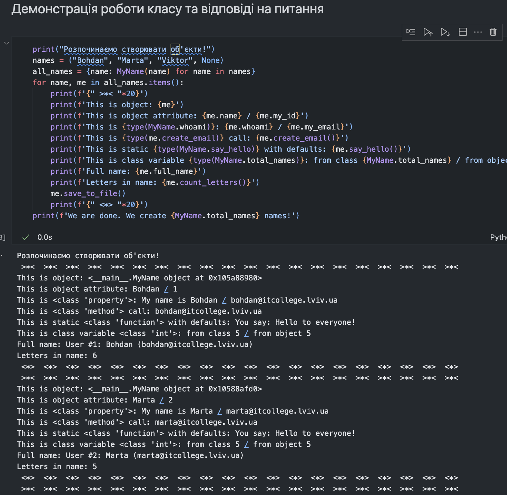
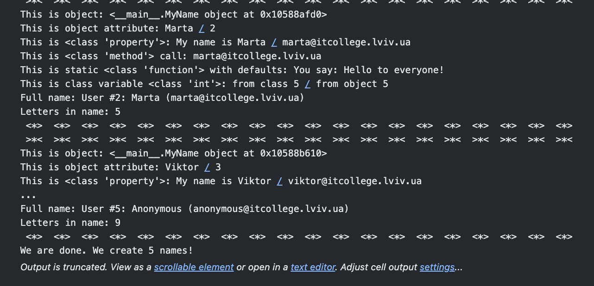
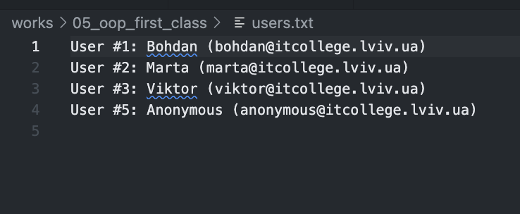

# Знайомство з ООП

## Тема
Перший клас у Python. Основи ООП, створення класу, атрибути, методи, властивості, модифікації.

## Мета роботи
Навчитись використовувати основні принципи ООП, розглянути конструкції побудови класу та створення об'єктів, навчитись працювати з ними, виконати індивідуальні завдання.

---

## Виконання роботи

- Створено клас `MyName` з усіма необхідними методами та властивостями.
- Додано своє ім'я у список імен.
- Виконано всі індивідуальні завдання (див. код та пояснення у ноутбуці).
- Додано відповіді на питання з лабораторної.
- Додано скріншоти виконання (у папку `assets`).

---

## Як відтворити

1. Запустіть файл `oop_first_class.py` для перевірки роботи класу та модифікацій.
2. Відкрийте та виконайте всі комірки у ноутбуці `oop_first_class.ipynb` для перегляду коду, результатів та пояснень.

---

## Висновок
- Ознайомився з основами ООП у Python.
- Навчився створювати класи, додавати атрибути, методи, властивості, працювати з класовими та статичними методами.
- Виконав індивідуальні завдання та зрозумів їхню суть.
- Отримав практичний досвід роботи з класами у Python.

---

## Скріни виконання

